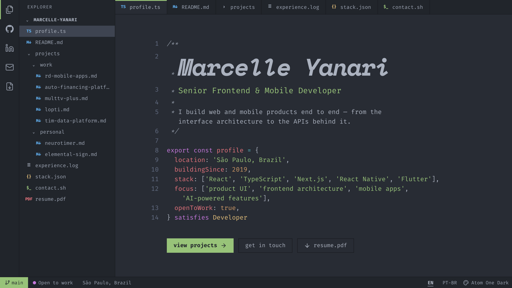

# Marcelle Yanari

**Senior Frontend & Mobile Developer** · São Paulo, Brazil · open to work

<b>→ <a href="https://portfolio-yanari.vercel.app">portfolio-yanari.vercel.app</a> ←</b>

I build web and mobile products end to end — from the interface architecture to the APIs behind it. React, TypeScript, Next.js, React Native and Flutter since 2019.

- Led analytics and CRM integrations in **RaiaDrogasil**'s mobile apps — 75% of its digital interactions
- Shipped **MultTV Plus**, a Flutter streaming app for iOS, Android and set-top boxes — 5,000+ downloads
- Built the core frontend and real-time AI chat of a **legal AI platform**
- Co-designed a GCP data platform for **TIM Brasil** over data from 62M+ customers

[Resume](https://portfolio-yanari.vercel.app/marcelle-yanari-resume.pdf) · [LinkedIn](https://www.linkedin.com/in/yanari) · [yanarimy@gmail.com](mailto:yanarimy@gmail.com)

Side projects: [filmow_to_letterboxd](https://github.com/yanari/filmow_to_letterboxd) (⭐ 45) · [neuro-timer](https://github.com/yanari/neuro-timer) · [portfolio](https://github.com/yanari/portfolio)
